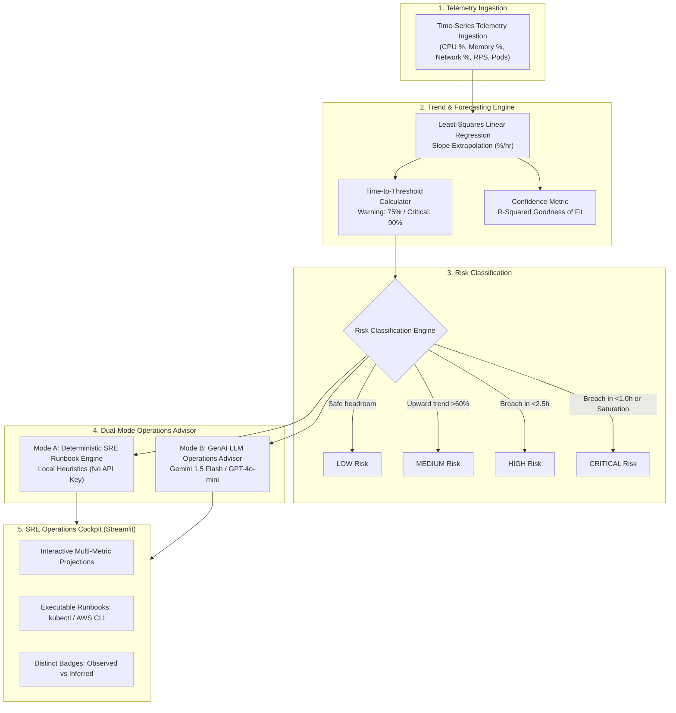

# ⚡ AI Capacity Forecaster — System Design & Technical Case Study

> **A Proactive Infrastructure Capacity Planning & Automated SRE Operations Cockpit**  
> *Author: Moin Hasan* • *Repository: [moin85m/ai-capacity-forecaster](https://github.com/moin85m/ai-capacity-forecaster)*

---

## 1. Executive Summary & Problem Statement

Modern cloud-native environments and microservice clusters frequently face **reactive incident management**:
- Traditional monitoring (Prometheus, CloudWatch, Datadog) triggers static threshold alarms **after** resources (CPU, Memory, Network) have already reached critical saturation.
- By the time on-call engineers are paged, services often experience degraded throughput, cascading container restarts (OOM-kills), and customer-facing latency breaches.

**AI Capacity Forecaster** is an intelligent Site Reliability Engineering (SRE) operations prototype designed to solve this by shifting capacity management from **reactive alerting** to **deterministic pre-breach forecasting and automated remediation**.

---

## 2. System Architecture & Telemetry Pipeline



---

## 3. Architecture Decision Records (ADRs) & Engineering Trade-Offs

### ADR-01: Explainable Linear Extrapolation vs Deep Learning (LSTM / Transformers)
- **Context**: Infrastructure engineering teams often explore deep time-series models (Prophet, LSTM, Temporal Transformers) for capacity prediction.
- **Decision**: Implemented least-squares linear trend regression with configurable lookback windows ($W \in [4, 24]$ hours) and $R^2$ goodness-of-fit scoring.
- **Rationale**:
  1. **Explainability & Trust**: On-call SREs under high-stress incident conditions require clear mathematical causality. The calculation $\text{ETA} = (90\% - y_{\text{current}}) / m$ is intuitive, defensible, and instantly auditable.
  2. **Sub-Millisecond Overhead**: Computes in-memory without requiring dedicated GPU infrastructure, model artifact storage, or retraining pipelines.
  3. **Short-Horizon Stability**: For 4–12 hour proactive scaling windows, linear trend extrapolation avoids the overfitting and hallucinated seasonality that unconstrained deep learning models introduce on noisy telemetry.

---

### ADR-02: Zero-Dependency Dual-Mode Reliability Pattern
- **Context**: Mission-critical reliability tooling must never introduce external single points of failure (SPOFs).
- **Decision**: Architected the platform around two distinct operational modes:
  - **Mode A (Deterministic Heuristic Engine)**: Operates 100% offline with zero external API credentials, executing rule-based risk classification and runbook generation.
  - **Mode B (AI-Assisted LLM Mode)**: If an AI key (Google Gemini or OpenAI) is present, telemetry summaries are structured into a strict prompt payload for high-level incident synthesis and architecture recommendations.
- **Rationale**: Guarantees that in air-gapped VPCs, network partitions, or third-party API rate-limit scenarios, the core capacity forecaster continues functioning with zero degradation.

---

### ADR-03: Strict Separation of Observed Facts vs AI Recommendations
- **Context**: LLM hallucinations or ambiguous alert semantics in production operations can lead to dangerous operational mistakes.
- **Decision**: The user interface strictly segregates data streams using color-coded badge annotations:
  - `[Observed Telemetry]`: Unmodified raw sensor metrics (timestamps, CPU %, memory %, ingress rate).
  - `[Deterministic Engine Logic]`: Mathematically calculated regression slopes, $R^2$ scores, and threshold ETAs.
  - `[AI Operations Advisor]`: Synthesized incident narratives and architectural optimization suggestions.
- **Rationale**: Complies with enterprise SRE observability standards and eliminates alert confusion.

---

## 4. Multi-Metric Correlation & Scenario Testing

The platform models multi-vector infrastructure stresses across:
- **Compute (CPU %)**: Identifies thread contention, unoptimized loops, and CPU quota saturation.
- **Memory (RAM %)**: Distinguishes between normal traffic-driven allocation and monotonic memory leaks (uncollected heap / cache growth).
- **Network Bandwidth (%)**: Monitors ingress/egress interface limits, flagging payload bloat or connection starvation.
- **Ingress Request Rate vs Pod Replicas**: Correlates traffic scale with Horizontal Pod Autoscaler (HPA) scaling responsiveness.

### Supported Simulation Profiles:
1. **Steady Workload Growth**: Simulates natural multi-day scaling leading to capacity exhaustion.
2. **Monotonic Memory Leak**: Constant request volume with steady heap consumption leading to predicted OOM-kills.
3. **Sudden Traffic Spike**: Sudden exponential influx of requests outpacing replica provisioning.
4. **Stable / Nominal Operations**: Confirms baseline operating headroom.

---

## 5. Automated SRE Runbooks & Remediation Outputs

Upon risk escalation, the system generates immediate copy-paste command runbooks:

```bash
# Kubernetes Horizontal Scale-Out:
kubectl scale deployment/api-gateway --replicas=6

# Verify Horizontal Pod Autoscaler target:
kubectl get hpa api-gateway -o yaml

# Inspect OOM-Killed container termination events:
kubectl get events --field-selector reason=OOMKilled -A

# Apply Ingress Token-Bucket Rate Limiting:
kubectl annotate ingress api-ingress nginx.ingress.kubernetes.io/limit-rps='150' --overwrite
```

---

## 6. Technical Stack & Implementation Details

| Component | Technology | Rationale |
|---|---|---|
| **Core Runtime** | Python 3.11 / 3.12 | Standard language for cloud automation and data infrastructure. |
| **Web UI** | Streamlit | Rapid, high-performance operational cockpit with reactive state management. |
| **Data Engine** | Pandas, NumPy | Vectorized time-series manipulation and least-squares regression math. |
| **Interactive Visuals** | Plotly Graph Objects | Multi-axis time-series visualization, threshold markers, and projection bands. |
| **AI Integration** | Google Gemini (`google-generativeai`), OpenAI (`openai`) | Flexible multi-provider LLM synthesis with defensive fallback. |
| **Cloud / Orchestration** | Kubernetes HPA, AWS Auto Scaling runbooks | Aligned with enterprise cloud reliability engineering practices. |

---

## 7. Verification & Quality Assurance

The codebase includes an automated validation suite (`tests/test_pipeline.py`) covering:
- Telemetry ingestion integrity and schema validation.
- Linear slope calculation, $R^2$ fitting, and edge-case handling (negative slopes, zero division, pre-existing breaches).
- Risk matrix categorization boundaries.
- Offline advisory output formatting.

```bash
# Execute test suite:
python3 tests/test_pipeline.py
# Output: ALL SMOKE TESTS PASSED SUCCESSFULLY! ✅
```
