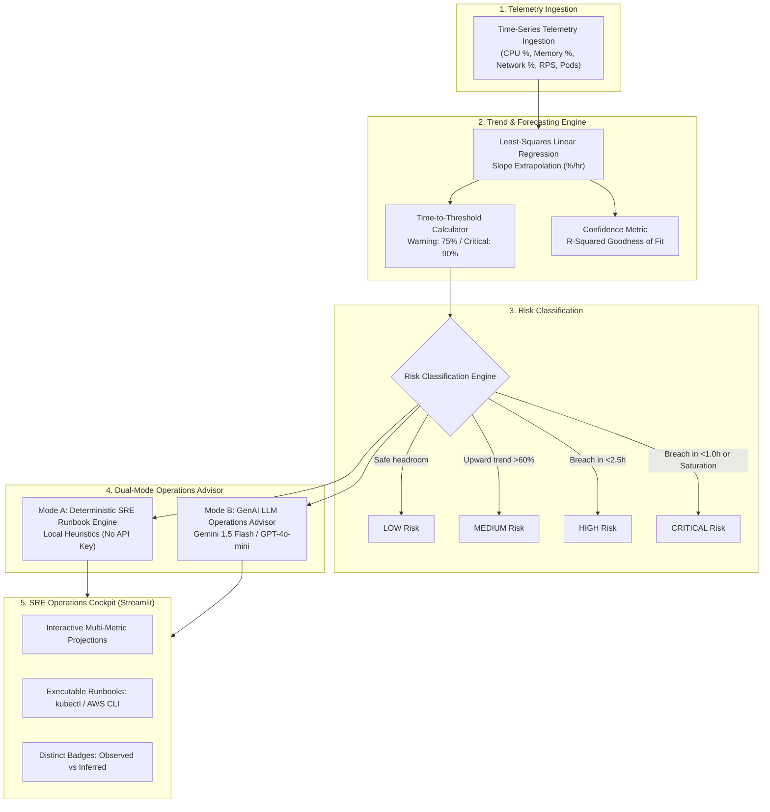

# 📄 Portfolio & Resume Project Showcase

# Project: AI Capacity Forecaster — Autonomous Infrastructure Operations Assistant

---

## 🎯 Executive Overview

**AI Capacity Forecaster** is a production-grade infrastructure operations and predictive capacity planning dashboard designed for **Site Reliability Engineering (SRE)**, **DevOps**, and **Cloud Platform** teams. 

Rather than relying on reactive threshold alerts that trigger *after* resource exhaustion occurs, the platform applies **time-series linear regression extrapolation** and a **dual-mode AI recommendation engine** to predict capacity saturation hours before failure, classify operational risk, and prescribe immediate remediation runbooks.

---

## 💼 Ready-to-Use Resume Bullet Points

Choose the variant that best matches your target role:

### Option 1: For Site Reliability Engineering (SRE) Roles
> • **Architected and developed "AI Capacity Forecaster"**, an automated infrastructure operations dashboard utilizing Python, Streamlit, and Plotly to predict compute, memory, and network saturation up to 12 hours in advance.  
> • **Engineered an explainable time-series trend forecasting engine** with configurable lookback windows and $R^2$ confidence scoring, replacing reactive alarms with proactive time-to-breach estimations.  
> • **Implemented a hybrid deterministic-and-Generative AI advisory system** (Google Gemini / OpenAI), automating incident triage, risk classification, and step-by-step `kubectl` / AWS CLI autoscaling runbooks.

### Option 2: For Cloud / DevOps Engineer Roles
> • **Designed an AI-assisted cloud capacity forecasting prototype** in Python, analyzing 48-hour multi-metric telemetry (CPU, RAM, Bandwidth, Ingress RPS) to automate cluster autoscaling decisions.  
> • **Built transparent 4-tier risk classification logic** (`LOW`, `MEDIUM`, `HIGH`, `CRITICAL`), correlating ingress request spikes with pod replica counts to prevent Out-Of-Memory (OOM) and compute saturation.  
> • **Created a zero-dependency offline fallback mode** alongside LLM-driven incident analysis, ensuring uninterrupted operational guidance in air-gapped or restricted cloud environments.

### Option 3: For Platform / Infrastructure Engineering Roles
> • **Developed an intelligent infrastructure capacity predictor** leveraging least-squares regression slopes to calculate exact time-to-threshold breaches across Kubernetes nodes and microservices.  
> • **Delivered interactive telemetry dashboards** with Plotly, providing real-time trend trajectories, threshold projection bands, and one-click synthetic failure scenario simulations (memory leaks, traffic surges).  
> • **Standardized incident response runbooks** with automated command generation, reducing Mean Time to Resolution (MTTR) and eliminating capacity firefighting.

---

## 🏛️ System Architecture & Workflow

---

## 💡 Key Technical Decisions & Interview Talking Points

### 1. Why Linear Regression instead of Complex Deep Learning (LSTM / Transformers)?
- **Explainability & Trust**: In high-stakes production operations, on-call SREs must understand *why* an alert was generated. Linear slopes ($\Delta\% / \text{hr}$) provide intuitive, defensible math ($[90\% - \text{current}] / \text{slope} = \text{ETA}$).
- **Low Compute Overhead**: Runs in milliseconds directly in memory without requiring GPU infrastructure or heavyweight training pipelines.
- **Short-Horizon Reliability**: Over a 4–12 hour forward horizon, short-term linear extrapolation performs comparably to complex time-series models without overfitting to high-frequency noise.

### 2. Dual-Mode Architecture (Mode A vs Mode B)
- **Zero-Dependency Resilience**: Production systems cannot rely exclusively on external LLM APIs that may experience rate-limits or outages during network partitions. Mode A provides 100% deterministic rule-based advice with zero credentials.
- **Synthesized Intelligence**: Mode B leverages LLMs strictly for high-level incident synthesis, root-cause hypothesizing, and architectural recommendations, with guardrails preventing hallucinated metrics.

### 3. Strict Separation of Observed Facts vs AI Recommendations
- Prominent UI badges distinguish `[Observed Telemetry]` from `[Deterministic Heuristic Logic]` and `[AI Operations Advisor]`. This prevents alert fatigue and ensures compliance with enterprise SRE observability standards.

---

## 🛠️ Tech Stack & Skills Highlighted

| Category | Technologies & Tools |
|---|---|
| **Languages & Runtimes** | Python 3.11 / 3.12 |
| **Frameworks & UI** | Streamlit, HTML5/CSS custom components |
| **Data Analytics** | Pandas, NumPy (least-squares linear algebra) |
| **Data Visualization** | Plotly Graph Objects (interactive multi-axis time series, projection lines) |
| **AI / LLM Integration** | Google Gemini API (`google-generativeai`), OpenAI API (`openai`) |
| **DevOps / Cloud Concepts** | Kubernetes HPA, AWS EC2 Auto Scaling, OOM-killer mitigation, CDN edge caching |

---

## 🌐 LinkedIn / GitHub Project Description

**Feel free to post this on LinkedIn or in your GitHub profile showcase:**

> 🚀 **Excited to share my latest project: AI Capacity Forecaster!**
>
> In high-scale cloud environments, reactive alerts often mean you're already experiencing downtime or degraded customer experiences. I built **AI Capacity Forecaster** to demonstrate how intelligent time-series forecasting and AI can assist SRE and DevOps teams in anticipating infrastructure bottlenecks.
>
> 🔹 **Proactive Saturation Projections**: Calculates exact time-to-breach for CPU, Memory, and Network capacity hours before limits are hit.  
> 🔹 **Transparent Risk Scoring**: Replaces black-box alerts with clear mathematical confidence ($R^2$) and 4-tier risk classification.  
> 🔹 **Actionable SRE Runbooks**: Automatically generates immediate horizontal/vertical scaling commands (`kubectl`, `aws`) and diagnostic steps.  
> 🔹 **Dual-Mode AI Engine**: Features a 100% offline deterministic rule engine alongside an LLM-assisted incident advisor.  
>
> Built with **Python, Streamlit, Pandas, NumPy, and Plotly**.
>
> 🔗 Code & Demo: [GitHub Link]
